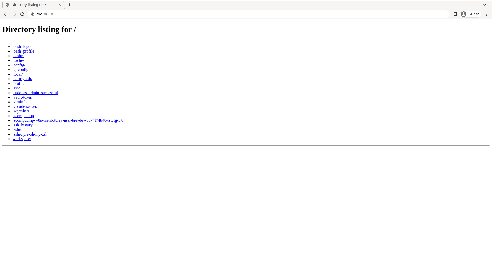

# How To Remotely Access A Workspace's `localhost` Without Making In Public

## For brev Versions Greater Than Or Equal To `0.7.0`


### using The brev Workspace Point To Point VPN 

By default all of your workspace's `localhost` are exposed to every other workspace and to your laptop by it's name.  To see the hosts that you can navigate too run.

```shell
$ brev ls hosts
brev-cli
brevdev-brev-docs
```

and use any of those names as a hostname in order to navigate to that workspace's web services. 

for example if in the workspace `brev-cli` I ran a python webserver on port `8000`, I will be able to navigate to it via the browser or through web clients like curl, etc. at `brev-cli:8000` for example:
For example, if you created an empty workspace with

```shell
brev start --empty --name foo
```
and deployed a webserver in your workspace with

```shell
python -m http.server
```


you will be able to access the webserver from any workspace by using the hostname `foo`. For example, from my laptop if I run


```shell
curl foo:8000
```

I will recieve a response from the webserver.

```shell
$ curl foo:8000
<!DOCTYPE HTML PUBLIC "-//W3C//DTD HTML 4.01//EN" "http://www.w3.org/TR/html4/strict.dtd">
<html>
<head>
<meta http-equiv="Content-Type" content="text/html; charset=utf-8">
<title>Directory listing for /</title>
</head>
<body>
<h1>Directory listing for /</h1>
<hr>
<ul>
<li><a href=".bash_logout">.bash_logout</a></li>
<li><a href=".bash_profile">.bash_profile</a></li>
<li><a href=".bashrc">.bashrc</a></li>
<li><a href=".cache/">.cache/</a></li>
<li><a href=".config/">.config/</a></li>
<li><a href=".gitconfig">.gitconfig</a></li>
<li><a href=".local/">.local/</a></li>
<li><a href=".oh-my-zsh/">.oh-my-zsh/</a></li>
<li><a href=".profile">.profile</a></li>
<li><a href=".ssh/">.ssh/</a></li>
<li><a href=".sudo_as_admin_successful">.sudo_as_admin_successful</a></li>
<li><a href=".vault-token">.vault-token</a></li>
<li><a href=".viminfo">.viminfo</a></li>
<li><a href=".vscode-server/">.vscode-server/</a></li>
<li><a href=".wget-hsts">.wget-hsts</a></li>
<li><a href=".zcompdump">.zcompdump</a></li>
<li><a href=".zcompdump-w8s-userdotbrev-nszi-brevdev-5b74f74b48-rswfg-5.8">.zcompdump-w8s-userdotbrev-nszi-brevdev-5b74f74b48-rswfg-5.8</a></li>
<li><a href=".zsh_history">.zsh_history</a></li>
<li><a href=".zshrc">.zshrc</a></li>
<li><a href=".zshrc.pre-oh-my-zsh">.zshrc.pre-oh-my-zsh</a></li>
<li><a href="workspace/">workspace/</a></li>
</ul>
<hr>
</body>
</html>
```


or I can navigate to my browser and navigate to my service there.





The behavior of workspace networking is that each workspace in an orginization is a part of the same point to point network, and any workspace in this network can be accessed over a network by it's name. Switching orginizations will switch the networking from one group of workspaces to another.


Note: The current implementation of point to point vpn networking for brev workspaces is dependent on userspace wireguard networking. Because of this, in order to be able to be able to make network calls from a workspace to another  workspace, you need to configure you're client to use a SOCKS5 PROXY. 


## For brev Versions Less Than `0.7.0`

### Using `port forward` Command

If you're using the CLI and local tools, see the [port-forward command](/reference/brev-cli#port-forward)

```zsh
brev port-forward brev-docs --port 3000:3000
```

This command runs interactive if the ports flag is left off.

