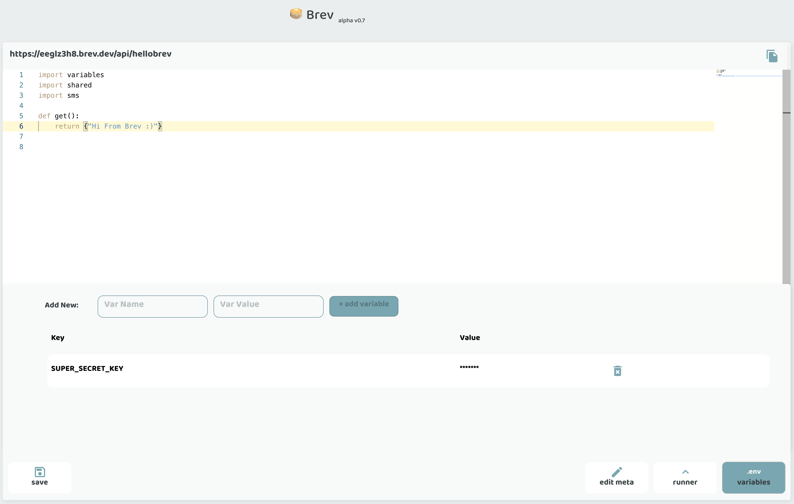

# How To #1
## Find my localhost

If you're inside your Brev workspace and are running something on localhost, you can access it using your workspace URL.

From the dashboard, copy your url:



Prefix the port number with a "-" and that's your localhost + port.

For example:

If your url is `jelly-brevdev.brev.sh` and you're running on `localhost:3000`, your localhost url is `3000-jelly-brevdev.brev.sh`.


=== "CLI"

    From the CLI, use the `add` command on the `env` resource:

    `brev env add --name MY_SECRET_KEY`

    This will prompt you to enter the value, and that's it! 


=== "Console"

    Open the environment variables (.env) from the button bar, add the variable name and value, click `add variable`! 

    
    

**Note:** these variables are protected per project. The variable value is encrypted and we don't support changing it. However, you can always delete it and add it back again with a different value. 

Freely use the variable in your code, insuring variables is imported:

```python
import variables

def get():
    print(f"Secret Key: {variables.MY_SECRET_KEY}")
    return{}
```

Doing this will make your code more secure, since the secret keys are encrypted and not pushed as part of your code. Additionally, your code will be cleaner since changing this variable only needs to happen in one place, no matter how often you use the variable.

