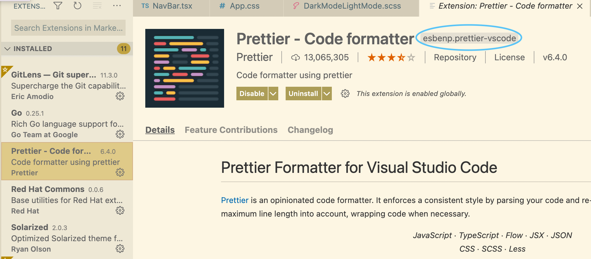

# How To #3
## Common Installations

See below for common installations to put in your .brev/setup.sh script

**Install Node/NPM**
```bash
# note this installs node v14
curl -fsSL https://deb.nodesource.com/setup_14.x | sudo -E bash -
sudo apt-get install -y nodejs
```

**Install Python, Pip, Poetry**
```bash

# install python
sudo apt-get install -y python3-distutils

sudo apt-get install -y python3-apt

# install pip
curl https://bootstrap.pypa.io/get-pip.py -o get-pip.py

python3 get-pip.py

rm get-pip.py

# this should go in your bashrc/zshrc too
export PATH="$PATH:/home/brev/.local/bin" 

# install poetry
curl -sSL https://raw.githubusercontent.com/python-poetry/poetry/master/get-poetry.py | python3 -

source $HOME/.poetry/env
          
```

**Install Node/NPM**
```bash
# note this installs node v14
curl -fsSL https://deb.nodesource.com/setup_14.x | sudo -E bash -
sudo apt-get install -y nodejs
```

**Install Node/NPM**
```bash
# note this installs node v14
curl -fsSL https://deb.nodesource.com/setup_14.x | sudo -E bash -
sudo apt-get install -y nodejs
```

**Install Basic Linux Utilities**
```bash
sudo apt-get install -y build-essential
```

**Install Zsh and Oh My Zsh**
```bash
# note: we recommend putting this in your personal .brev, not the repo .brev
# Go to Account in the console to update your .brev
sudo apt-get install zsh -y

sh -c "$(curl -fsSL https://raw.githubusercontent.com/ohmyzsh/ohmyzsh/master/tools/install.sh)" "" --unattended
            
echo "zsh" >> ~/.bashrc

```

**Install VS Code Extensions**

For the terminal command to install a VS Code extension, you'll need the highlighted ID, see below:



Use the following ID in the line below:
```bash
code-server --install-extension <HIGHLIGHTED_ID>
```