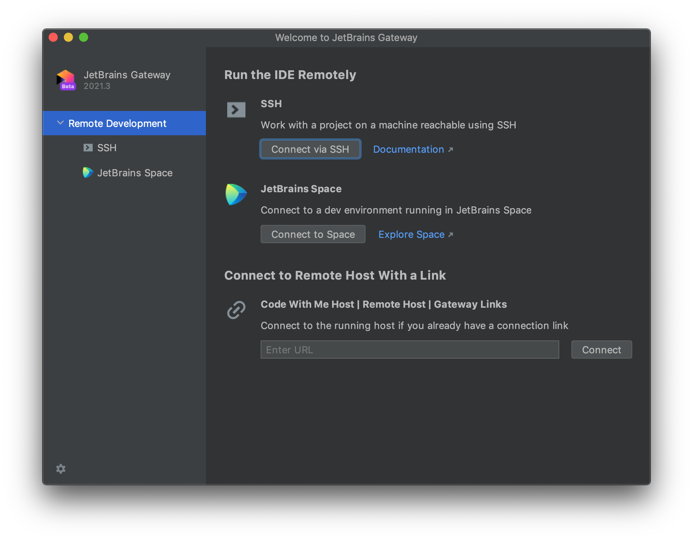

# Connect to a Brev dev environment using JetBrains

Make sure you have the [Brev CLI installed](/)

---

_This includes Webstorm, GoLand, IntelliJ IDEA, PyCharm etc._

You will need to open JetBrains Gateway instead of your locally installed JetBrains IDE. It will install the language process server and other heavyweight processes on the remote machine, while exposing the client of the IDE to you.

We guide you through this process the first time you download the CLI, but a link to manually download the software is here: [jetbrains.com/remote-development/gateway](https://www.jetbrains.com/remote-development/gateway/)

1. Run `brev jetbrains` in your terminal. Only for Jetbrains products, this process needs to stay running to maintains the connection to your computer. Our next major release gets rid of this step (eta 2 weeks--  March 2022).  

2. Open JetBrains Gateway and select "Connect Via SSH".

3. Your Brev machines should already be listed for you! Select the correct machine and click "Check Connection and Continue". If you do not see your brev machine, [skip to the end](#do-it-manually) of this to manually add ssh connection details 👇

4. Select the IDE you'd like to use. Enter the project directory. This will always be `/home/ubuntu/<GIT_REPO_OR_PROJECT_NAME>`. If you don't know the GIT_REPO_OR_PROJECT_NAME, simply click on the folder icon to find the correct folder. Click Download and Start IDE! That's it!

---

### Do It Manually

To manually add SSH connection details:

1. Select `<New Connection>` from the Connection dropdown

2. Enter the following information:
	* **Username:** brev
	* **Host:** localhost
	* **Private Key:** `<ROOT>/.brev/brev.pem`. `ROOT` is ~, in Mac this would be `/Users/<USERNAME>`. You must enter the absolute path, relative paths will not work.
	* **Save Passphrase:** Unchecked
	* **Port:** Select the port of the brev project displayed in your terminal after entering brev up. See example below:

3. Go back to step 3) and continue from there 🙂
