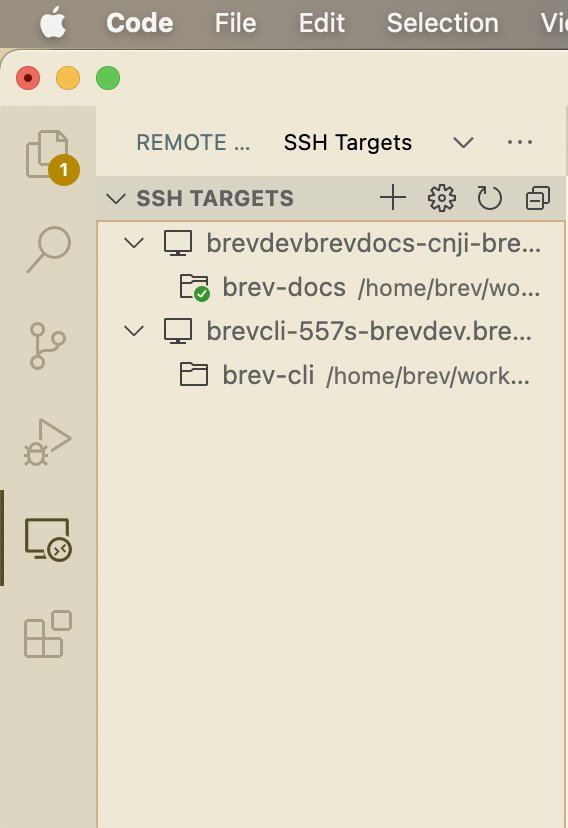
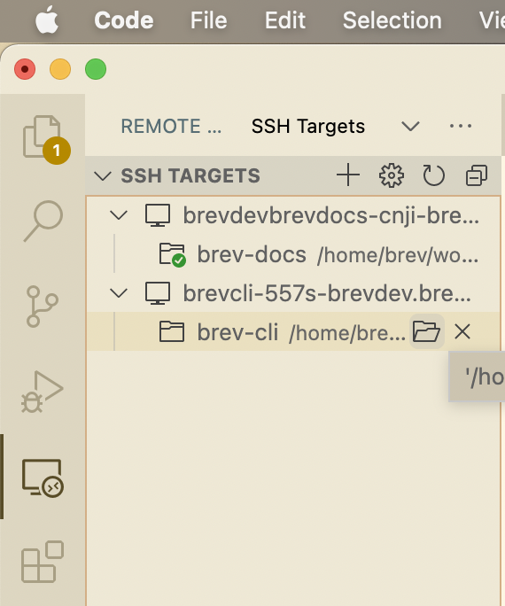

# Connect to a Brev dev environment using VSCode

The easiest way is to run brev open with the Brev CLI:
<!-- [brev open <env-name>](/reference/brev-cli#open) -->
```zsh
brev open <env-name>
```

This opens VS Code directly to the default folder. You can change the default folder in the [console](https://console.brev.dev).

---

Alternatively: Open VS Code and use the [Remote - SSH extension](https://marketplace.visualstudio.com/items?itemName=ms-vscode-remote.remote-ssh){:target="_blank"} to access the remote machine.

1. Download the [Remote - SSH extension](https://marketplace.visualstudio.com/items?itemName=ms-vscode-remote.remote-ssh){:target="_blank"} extension


2. With the extension downloaded, open the command palette and type in ssh. Select Remote-SSH: Connect to Host...


3. Select your environment, and that's it!


---

By the way, if you're connecting to a dev environment that you've connected to in the past, you can open up directly to the folder:

1. Click on the Remote Explorer icon


2. Click on the folder icon for the dev environment you want to connect to

