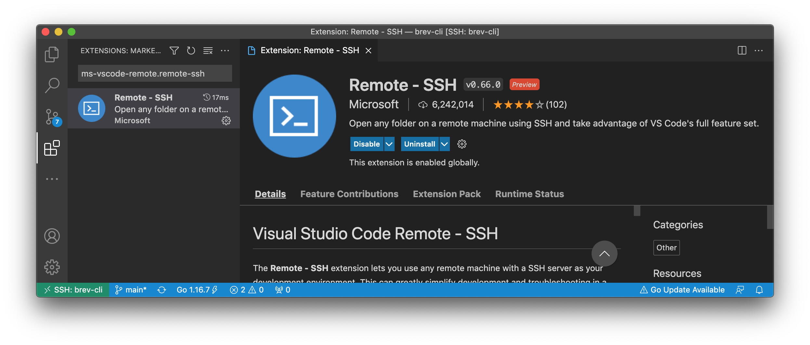
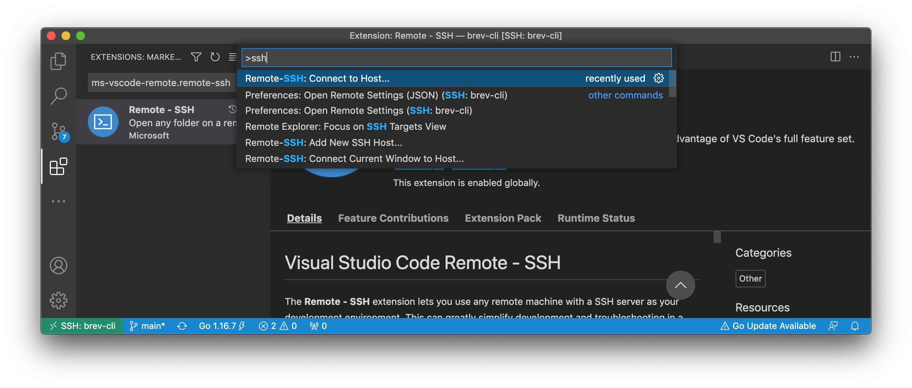
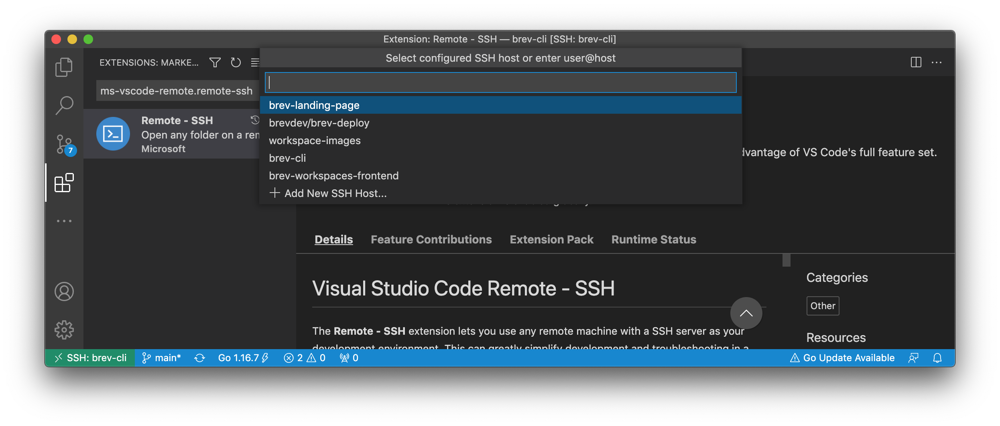

# Connect to a Brev workspace using VSCode

Make sure you have the [Brev CLI installed](/)

---

Open VS Code and use the [Remote - SSH extension](https://marketplace.visualstudio.com/items?itemName=ms-vscode-remote.remote-ssh){:target="_blank"} to access the remote machine.

1. Download the [Remote - SSH extension](https://marketplace.visualstudio.com/items?itemName=ms-vscode-remote.remote-ssh){:target="_blank"} extension

2. With the extension downloaded, open the command palette and type in ssh. Select Remote-SSH: Connect to Host...

3. Select your workspace, and that's it!

