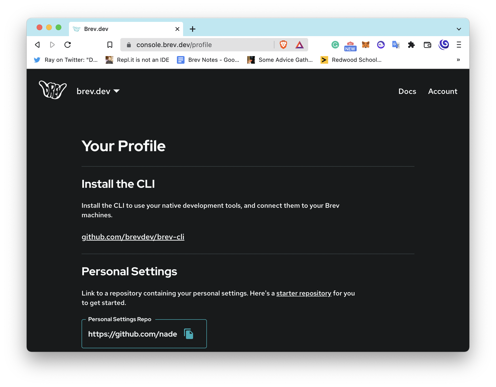
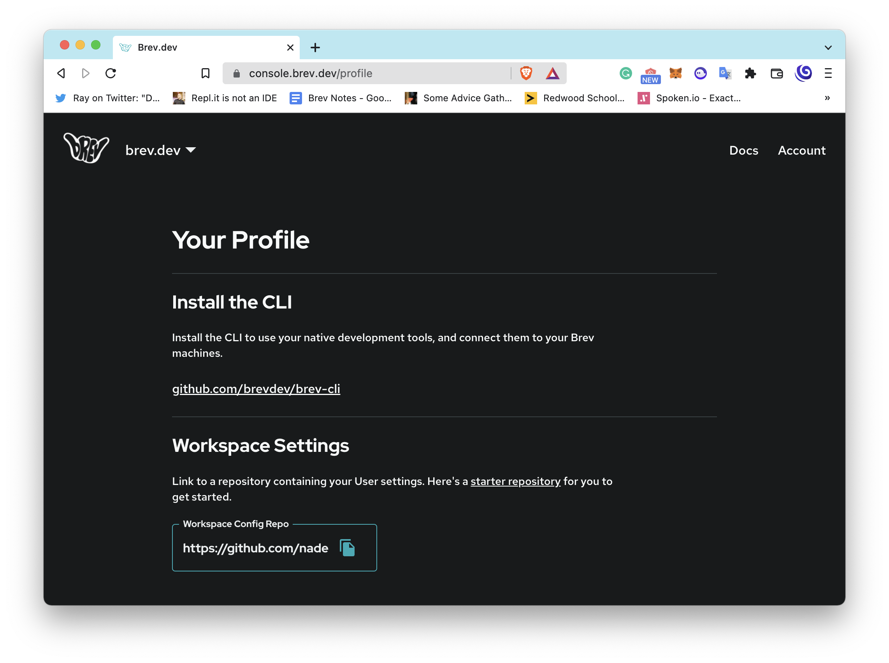

# How To
## Copy Personal Settings
You probably have specific settings you wanna bring to every workspace.

Brev.dev supports you having your own setup script. The repo has a `.brev/setup.sh` file that gets run on workspace complete, but Brev.dev also runs your personal `.brev/setup.sh` if it exists.

From [the console](https://console.brev.dev){:target="_blank"}, go to your profile by clicking "Account" on the top-right.

<!--  -->

You'll see a section called **Personal Settings**. This has a git repo that Brev.dev clones into every workspace and runs the `.brev/setup.sh` it contains.

To setup your personal settings:

1. [Click here to fork the personal settings repository](https://github.com/brevdev/user-dotbrev/fork)

2. Copy the new url, and paste it in the input field under **Personal Settings** and click the save button.

You're done!

Now every workspace will clone this repo and run your personal settings.

## Make it yours!

Clone your forked repo-- or from any workspace, cd into `/workspace/user-dotbrev`. Commit and push any changes and your next Brev.dev workspace will automatically clone the latest.