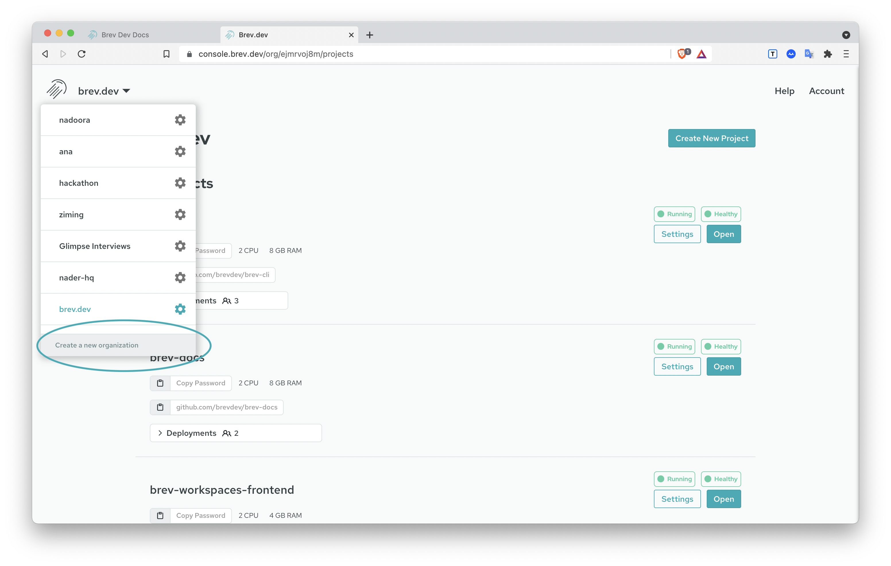
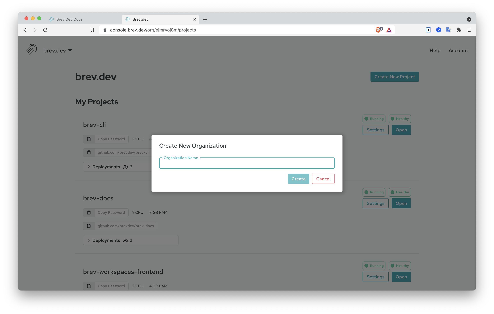

# Create a Brev Organization

You can create a Brev organization in the [Brev dashboard](https://console.brev.dev){:target="_blank"}.

From the Organization dropdown at the top, click `Create New Organization`.

Give it a name, and click Create! 

