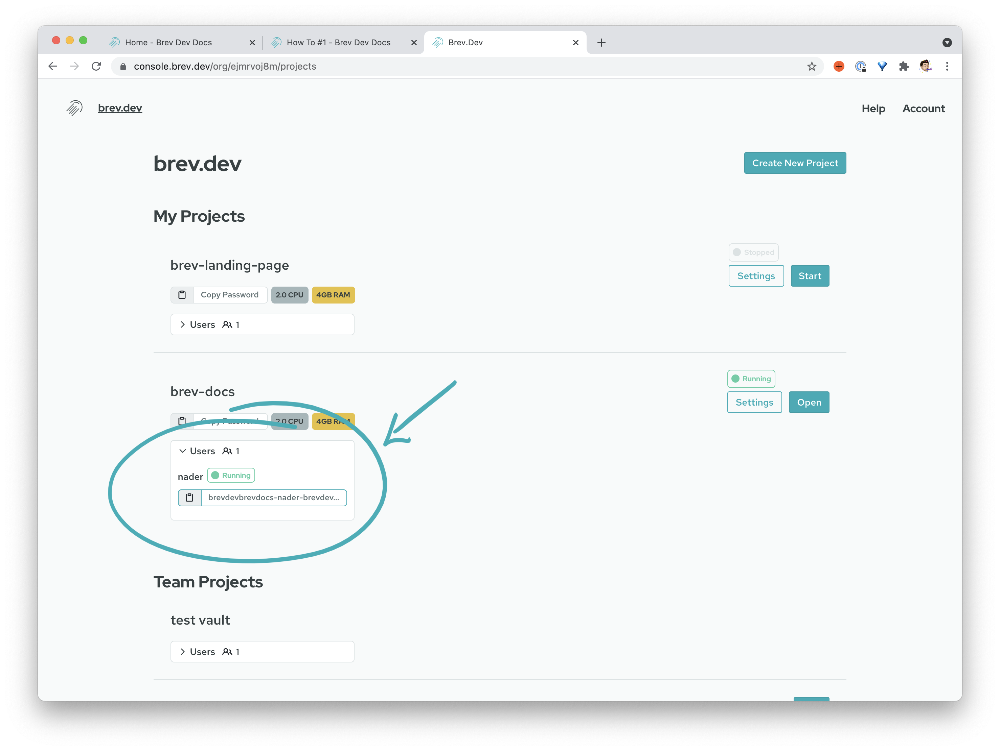

# How To
## Find my localhost

If you're using the CLI and local tools, see the [port-forward command](/reference/brev-cli#port-forward)

If you're inside your Brev workspace and are running something on localhost, you can access it using your workspace URL.

From the dashboard, copy your url:

Prefix the url with your port number + "-" and that's your url!

For example:

If your workspace url is `jelly-brevdev.brev.sh`

and you're running on `localhost:3000`

your localhost url is `3000-jelly-brevdev.brev.sh`.

