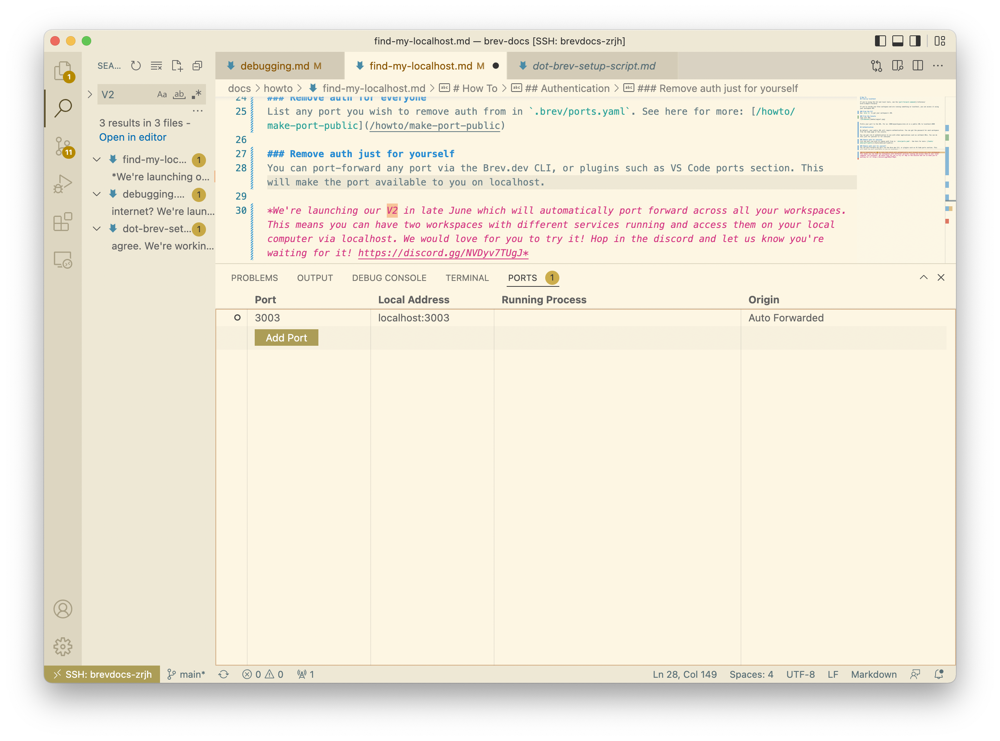

# How To
## Find my localhost

If you're using the CLI and local tools, see the [port-forward command](/reference/brev-cli#port-forward)

If you're inside your Brev workspace and are running something on localhost, you can access it using your workspace URL.

Prefix your port to the workspace URL. For ex: 3000-myworkspace.brev.sh is a public URL to localhost:3000

### Get your URL from the CLI
Run `brev ls` to get your workspace's URL

### Get your URL from the console
Copy your URL:

## Authentication
 
By default, your public URL will require authentication. You can get the password for each workspace from the home page of the console.

You can get rid of authentication to use with other applications such as callback URLs. You can do this just for yourself or for everyone.

### Remove auth for everyone
List any port you wish to remove auth from in `.brev/ports.yaml`. See here for more: [/howto/make-port-public](/howto/make-port-public)

### Remove auth just for yourself
You can [port-forward any port via the Brev.dev CLI](/reference/brev-cli#port-forward), or use plugins such as VS Code ports section. This will make the port available to you on localhost.

*We're launching our V2 in late June which will automatically port forward across all your workspaces. This means you can have two workspaces with different services running and access them on any machine via localhost. We would love for you to try it! Hop in the discord and let us know you're waiting for it! https://discord.gg/NVDyv7TUgJ*

