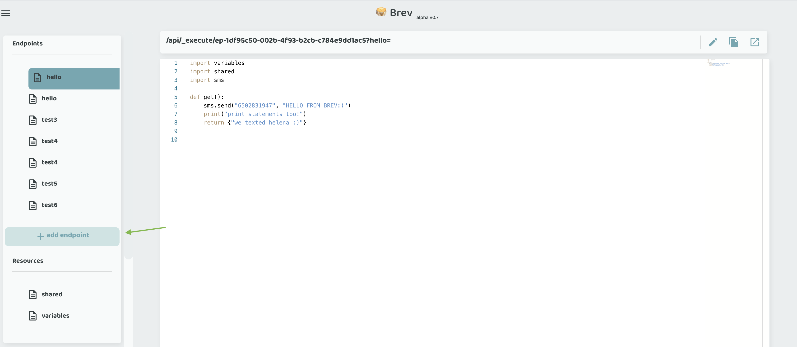

# How To #5
## How to Create an Endpoint

=== "CLI"

    To create an endpoint, simply use the `add` command on the `endpoint` resource.

    ```bash
    brev endpoint add --name MyNewEndpoint
    ```

    You'll now have a file `MyNewEndpoint.py` which has a get function.


=== "Console"

    Click on the "Add Endpoint" button.

    
    
    Give it a name, and a new resource file will be created with a get function.


You can handle other request types, see more on the next page.
