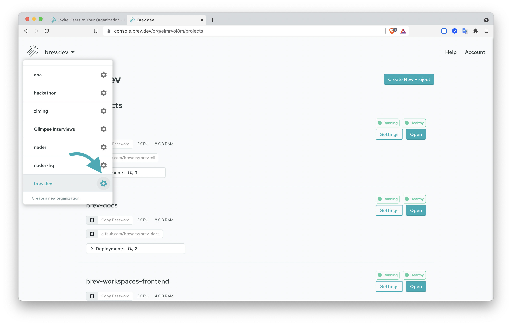
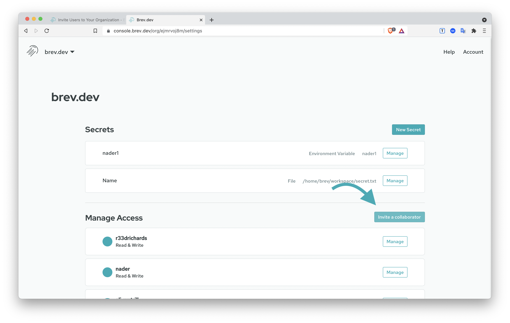
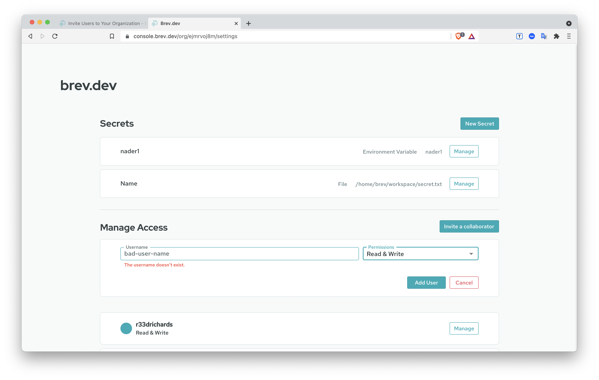

# Invite Users to Your Organization

You can invite users to your organization from the org settings page in the [Brev dashboard](https://console.brev.dev){:target="_blank"}

From the Organization dropdown at the top, click on the gear ⚙️ for your organization.

Click on the `Invite a Collaborator` button

Type in a valid username in, select the permission scope, and click `Add User`.

