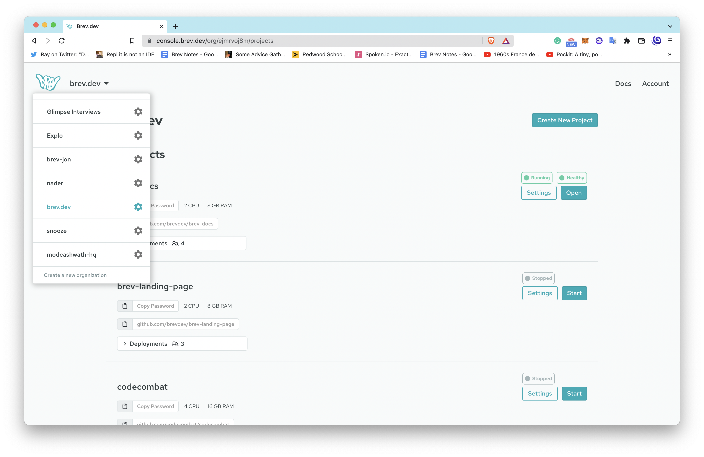
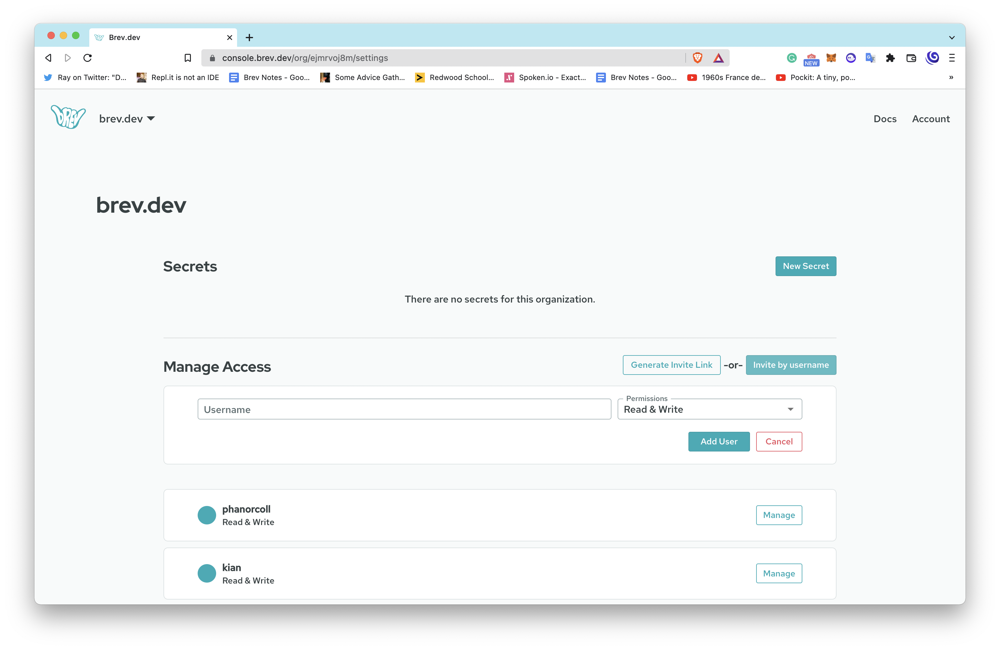

# Invite Users to Your Organization

To invite users to your organization:

## From the CLI

Run `brev invite` to generate an invite link and share it with a teammate. This will prompt your teammate to create an account if they don't have one already.

## From the Console
Go to your org settings page in the [Brev console](https://console.brev.dev){:target="_blank"}

From the Organization dropdown at the top, click on the gear ⚙️ for your organization.

Click on the `Invite by Username` button or `Generate Invite Link`. If you generate the invite link, it will prompt your teammate to create an account if they don't have one already.

## Other ways to share

<!-- Looking to share your dev environment without collaborating? Generate a link to let someone clone your workspace in their org. See here: [howto/share-your-workspace](/howto/share-your-workspace) -->

Put your localhost on a public URL to share your in-progress work: [howto/find-my-localhost](howto/find-my-localhost)

