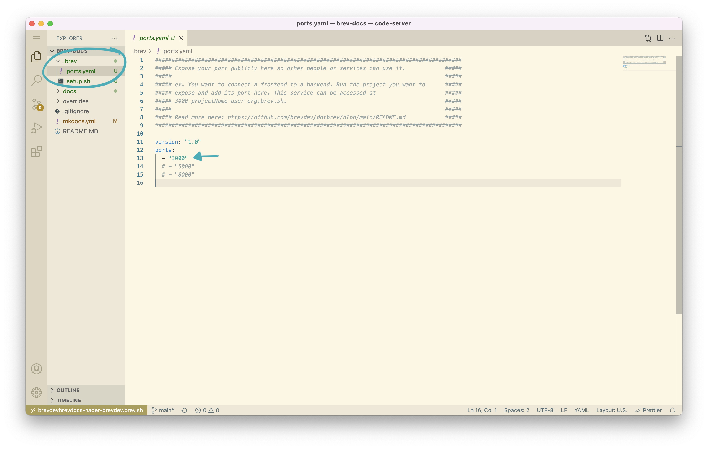

# How To Make A Port Public


 If you're inside your Brev workspace and are running something on localhost, you can access it using your workspace URL.


run `brev ls` to see your workspace`s url
```
$ brev ls

You have 1 workspaces in Org brev.dev
NAME                                     STATUS             ID            URL
brevdev/brev-docs                        RUNNING            lhw2g3i9c     brevdevbrevdocs-3i9c-brevdev.brev.sh


Connect to your machine with one of the following:
	ssh brevdevbrevdocs-3i9c

```

edit you're project's `.brev/ports.yaml` and specify which port that you want to expose 

```
#############################################################################################
##### Expose your port publicly here so other people or services can use it.            #####
#####                                                                                   #####
##### ex. You want to connect a frontend to a backend. Run the project you want to      #####
##### expose and add its port here. This service can be accessed at                     #####
##### 3000-projectName-user-org.brev.sh.                                                #####
#####                                                                                   #####
##### Read more here: https://github.com/brevdev/dotbrev/blob/main/README.md            #####
#############################################################################################

version: "1.0"
ports:
  - "3003"
  # - "5000"
  # - "8000"
```

and then navigate to the workspace's public url `3003-brevdevbrevdocs-3i9c-brevdev.brev.sh`. The workspace url is prefixed with the port number that you chose to expose. 




Add the port you wish to expose in the list and that's it!

**Note:** the version field is optional. It could be useful if you choose to commit this to your project repo.
