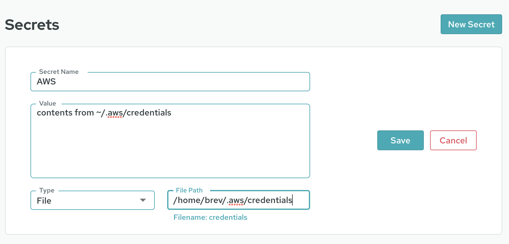
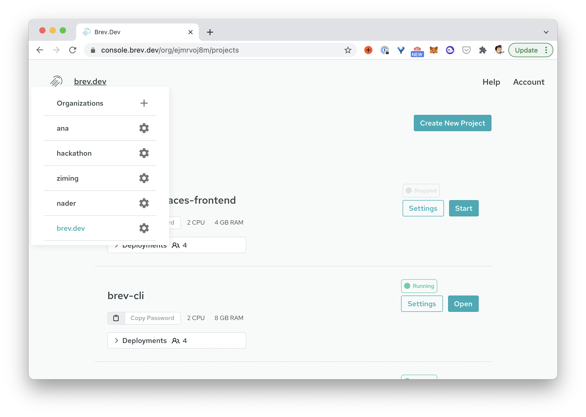

# How To
Securely use secret variables

If you're building with services such as AWS, you'll need a secure place for credentials and configs, such as those in the `~/.aws` directory on your computer. Brev has an encrypted secrets manager for these types of variables.

## From the CLI
From the CLI, run `brev secret` and follow the prompts. To avoid interactive mode, pass in all the data via flags. See here: [/reference/brev-cli](/reference/brev-cli)

## From the console
Go to your [Account page on the Brev console](https://console.brev.dev/profile){:target="_blank"} for the encrypted secrets manger

Click on "New Secret and populate the form accordingly. 

You can load environment variables or change the type from "Environment Variables" to "File" for something like the .aws/credentials file (as shown in the picture).

### Setting secrets or environment variables for your o`rganization

The example above sets your personal secret for all of your Brev dev environments. If you wish to set a variable or secret for your entire org, go to your organization's settings from the organization drop down

and use the encrypted secret manager there.

