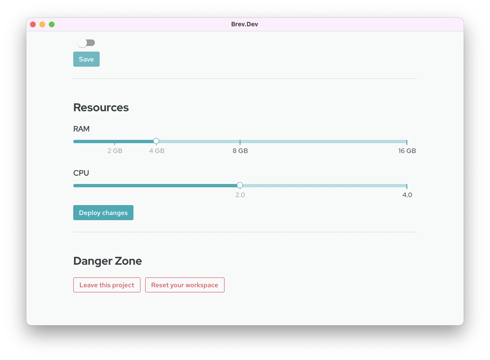

# How To 
## Reset Your Machine

If you [setup your .brev directory](/howto/automatically-set-up/), you can easily dispose of machines if they get into a bad state. Your fresh machine will come configured, so you can freely reset when you encounter problems.

*Note: Resetting your workspace will save uncommitted files, so you can freely use brev reset when experimenting with the setup script*

### From the CLI
Run `brev reset <workspace-name-or-id>`

### From the console
Go to workspace settings and clicking the 'reset' button in the Danger Zone. 

