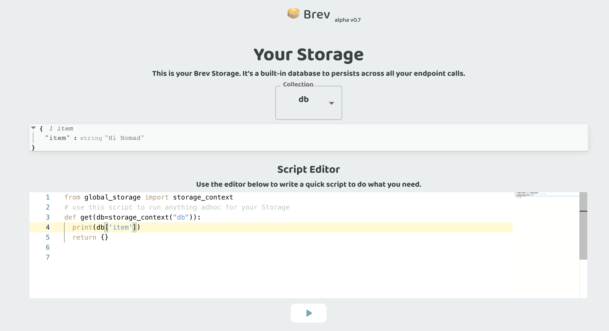

# Storage Context: The Brev Built-In Database

Brev's built-in database is a minimal nosql key value store built on top of DynamoDB. Persist data between your API calls within a project without any configuration! Brev reliably handles throughput of 5000 requests/second


### Technical Details:
- The database supports eventual consistency
- Currently each collection is implemented as a single Dynamodb partition key. This works for most use cases but can be a bottle neck for high throughput applications.

## Python Usage
The Brev DB works very similarly to [python's dictionary type](https://realpython.com/python-dicts/)

Access the database by importing `storage_context` from `global_storage` and using `storage_context` as the default value for a keyword argument in an endpoint.

```python
from global_storage import storage_context

def get(db=storage_context("my_table_name")):
    val = db["key"] # get item

    val = db.get("key", "default")  # get item and return 'default' if 'key' does not exist

    db["key"] = "value"  # set 'value' to 'key'

    val = db.setdefault("key", "value")  # set 'value' if 'key' does not exist return stored value

    return {"value": val}

```

Hint: as you access objects in the Brev DB, they are cached per request. Once the endpoint is ready to respond, the changes are saved to the database.

Technical Detail: The storage_context is implemented as a dependency/dependable. Read more about [FastAPI's lightweight depedency injection here](https://fastapi.tiangolo.com/tutorial/dependencies/).


## Collections

You can think of Collections as your database table or database name. Declare different collections to group objects together by specificying the name of the collection as the parameter of `storage_context`.

```python
from global_storage import storage_context

def get(user_db = storage_context("users"), item_db = storage_context("items")):
  user_id = "user_id"

  email = user_db[user_id]["email"]

  items = item_db[user_id]

  return {"email": email, "items": items}

```

## View Your Database Contents

You can use the database viewer in the Brev console to view or modify your database contents. Navigate to the Storage page, or use the cmd/ctrl + s keyboard shortcut.



There's a script editor for ad hoc database scripts. You can use this for queries or modifications. 

## Brev DB API Reference

### Types

The following types can be used as keys to the Brev DB.
```python
StorageKey = Union[int, str, bool, float]
```
The following is supported as values returned from the Brev DB.

```python
StorageValue = Union[StorageKey, None, List, Dict]
```
### Dependable

```python
storage.storage_context(collection: str="default") -> fastapi.Depends
```

- Parameters
  - collection: a string to designate what collection of objects the storage context will be
- Returns: A fastapi dependable that creates a StorageContext yields the StorageContext then saves all changes made.


### StorageContext API

```python
class StorageContext:
```

The StorageContext api is similar to a python dict object. Objects are ordered by insertion.

#### __getitem___
```python
__getitem__(key: StorageKey) -> StorageValue
```

Implements `storage_context[key]` bracket notation. Raises a KeyError if item does not exist.

- Parameters
  - key: A `StorageKey` key to retrieve an object
- Returns: The object in storage if it exists in cache else retrieves from database

#### __setitem___

```python
__setitem__(self, key: StorageKey, value: StorageValue) -> None:
```

- Parameters
  - key: A `StorageKey` to be used for retrieval.
  - value: A `StorageValue` which is used as its value.
- Returns: The object in storage if it exists in cache else retrieves from database

#### __commit___

```python
commit() -> None
```

Manually save session cache to database. This is automatically called after you return from a endpoint handler.

#### __get___

```python
get(key: StorageKey, default: Optional[StorageValue]=None) -> StorageValue
```

- Parameters
  - key: A `StorageKey` key to retrieve an object
  - default: the value to return if the object does not exist
- Returns: The object in storage if it exists in cache else retrieves from database

#### __update___

```python
update(to_update: Dict[StorageKey, StorageValue]) -> None
```

- Parameters
  - to_update: a dict to bulk update keys and values in the database
- Returns: None

#### setdefault

```python
setdefault(key: StorageKey, default_value: StorageValue) -> StorageValue
```

Sets `default_value` as the value of `key` if key does not exist. Returns the value in the database,

- Parameters
  - key: A `StorageKey` key to retrieve an object
  - default: A `StorageValue` to be set if key does not exist
- Returns: A `StorageValue` object that is the value uses in a `storage_context`

#### delitem

```python
___delitem___(key: StorageKey) -> None
```

Implements `del storage_context[key]` syntax. Removes object with `key` from Storage.

- Parameters
  - key: A `StorageKey` key to retrieve an object
- Returns: None


#### pop

```python
pop(key: StorageKey) -> StorageValue
```

Removes object with `key` from Storage and returns removed object

- Parameters
  - key: A `StorageKey` key to retrieve an object
- Returns: `StorageValue` object in db

#### clear

```python
clear() -> None
```

Removes all items from database in collection

#### len

```python
__len__() -> int
```

Implements `len(storage_context)` syntax. Returns number of items in the collection.

- Returns: An int of how many items are in the collection.

#### contains

```python
__contains__(key: StorageKey) -> bool
```

Implements `key in storage_context` syntax. Returns bool if key exists in collection

- Parameters
  - key: A `StorageKey` key to retrieve an object
- Returns: A bool. True if key exists.

#### keys

```python
keys() -> Iterable[StorageKey]
```

Retrieves all keys in a collection

- Returns: An iterable of keys

#### values

```python
values() -> Iterable[StorageValue]
```

Retrieves all values in a collection

- Returns: An iterable of `StorageValue`

#### items

```python
items() -> Iterable[Tuple(StorageKey, StorageValue)]
```

Retrieves all objects as an iterable tuple of StorageKey, StorageValue in a collection

- Returns: An iterable of `Tuple(StorageKey, StorageValue)`

