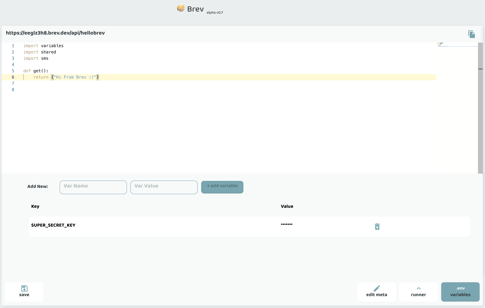

# Variables
 
Brev comes with a built in encrypted secrets/environment manager. 

Add any environment variable or secret by:

=== "CLI"

    From the CLI, use the `add` command on the `env` resource:

    `brev env add --name MY_SECRET_KEY`

    This will prompt you to enter the value, and that's it! 

=== "Console"

    Open the environment variables (.env) from the button bar, add the variable name and value, click `add variable`! 

    
    

**Note:** these variables are protected per project. The variable value is encrypted and we don't support changing it. However, you can always delete it and add it back again with a different value. 

- You can use any of your variables by the `variables` object in your endpoint code.
     For example:

```python
import variables
def get():
    return {"var": variables.THIS_IS_MY_KEY}
```
