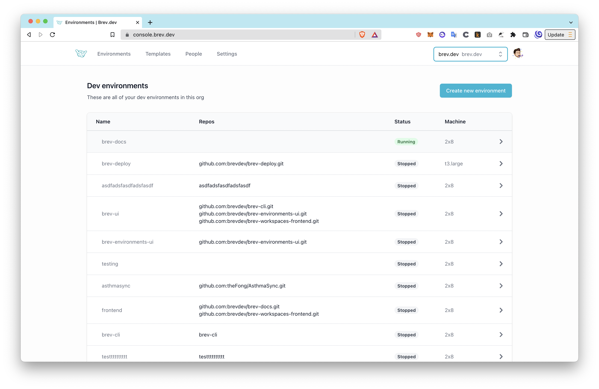
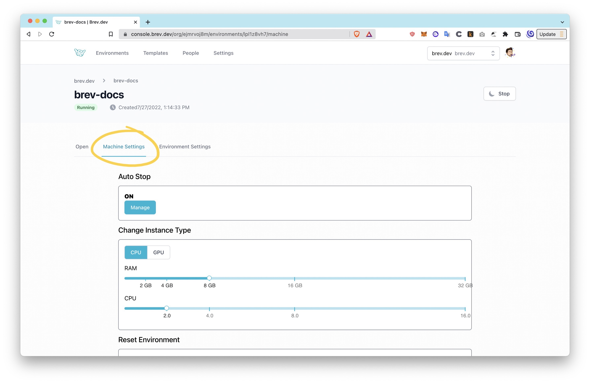
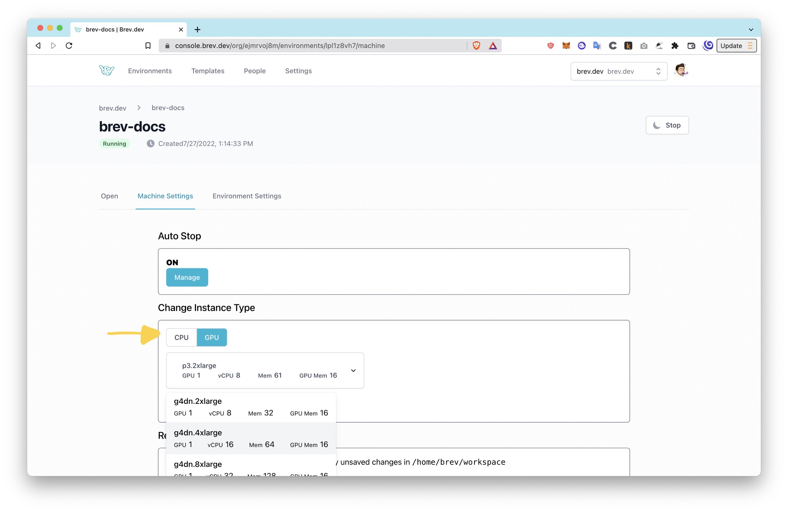
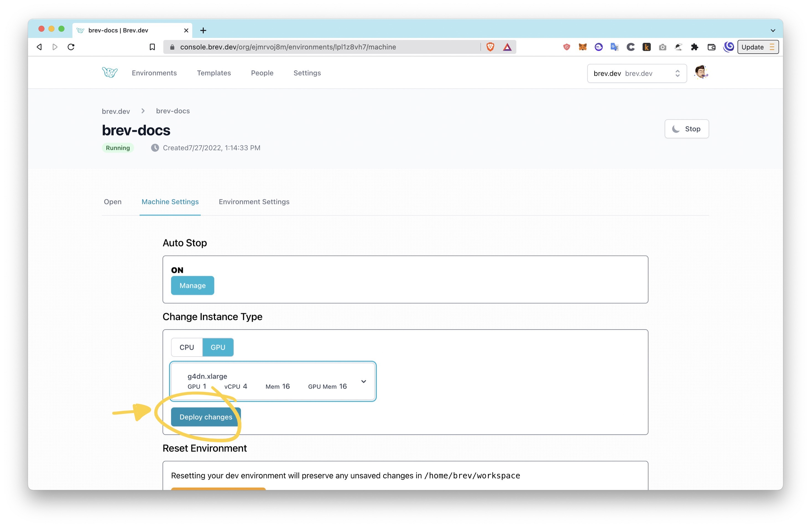

# Brev for GPU Dev Environments! 🤙

This page is documentation for Brev GPU dev environments. Brev can help save money on GPUs by:

1. Automatically shutting down the instance after 3 hours of inactivity. All uncommitted work is saved and can be easily resumed.

2. Enabling your dev environment to change instances. You can start on a very cheap 2x4 and only move to a GPU instance when you need it, and back down to a CPU-only instance using the `brev scale` command or through the UI.

## Getting Started

To start using Brev GPU dev environments, upgrade your CLI to the latest (or install it)

```zsh
brew install brevdev/homebrew-brev/brev
```

To install

```zsh
brew upgrade brevdev/homebrew-brev/brev
```

## How to upgrade or downgrade your dev environment

**Using the CLI:**

Run `brev scale` with the instance you want to scale up or down to. Use the `--gpu` or `--cpu` flag accordingly.

For example, to scale to a g5g.xlarge GPU instance, run:

```zsh
brev scale brev-environments-ui --gpu g5g.xlarge
```

To scale into a 2x8 CPU instance, run:

```zsh
brev scale brev-environments-ui --cpu 2x8
```

See [below](#CPU-instance-types) for available instance types

**Using the UI:**

1. From the [console](https://console.brev.dev), click on your dev environment to go to the environment settings page
   

2. Click on the "Machine Settings" tab to change the instance type
   

3. Click on GPU or CPU to see the different instance types
   

4. Once the new instance is selected, click Deploy Changes and hang tight while it updates
   

## CPU instance types

| Instance Name | CPU | mem |
| ------------- | --- | --- |
| 2x2           | 2   | 2   |
| 2x4           | 2   | 4   |
| 2x8           | 2   | 8   |
| 4x16          | 4   | 16  |
| 8x32          | 8   | 32  |

## GPU instance types

| Instance Name | GPU | vCPU | mem  | GPUMem |
| ------------- | --- | ---- | ---- | ------ |
| p4d.24xlarge  | 8   | 96   | 1152 | 320    |
| p3.2xlarge    | 1   | 8    | 61   | 16     |
| p3.8xlarge    | 4   | 32   | 244  | 64     |
| p3.16xlarge   | 8   | 64   | 488  | 128    |
| p3dn.24xlarge | 8   | 96   | 768  | 256    |
| p2.xlarge     | 1   | 4    | 61   | 12     |
| p2.8xlarge    | 8   | 32   | 488  | 96     |
| p2.16xlarge   | 16  | 64   | 732  | 192    |
| g5.xlarge     | 1   | 4    | 16   | 24     |
| g5.2xlarge    | 1   | 8    | 32   | 24     |
| g5.4xlarge    | 1   | 16   | 64   | 24     |
| g5.8xlarge    | 1   | 32   | 128  | 24     |
| g5.16xlarge   | 1   | 64   | 256  | 24     |
| g5.12xlarge   | 4   | 48   | 192  | 96     |
| g5.24xlarge   | 4   | 96   | 384  | 96     |
| g5.48xlarge   | 8   | 192  | 768  | 192    |
| g5g.xlarge    | 1   | 8    | 4    | 16     |
| g5g.2xlarge   | 1   | 16   | 8    | 16     |
| g5g.4xlarge   | 1   | 32   | 16   | 16     |
| g5g.8xlarge   | 1   | 64   | 32   | 16     |
| g5g.16xlarge  | 2   | 128  | 64   | 32     |
| g5g.metal     | 2   | 128  | 64   | 32     |
| g4dn.xlarge   | 1   | 4    | 16   | 16     |
| g4dn.2xlarge  | 1   | 8    | 32   | 16     |
| g4dn.4xlarge  | 1   | 16   | 64   | 16     |
| g4dn.8xlarge  | 1   | 32   | 128  | 16     |
| g4dn.16xlarge | 1   | 64   | 256  | 16     |
| g4dn.12xlarge | 4   | 48   | 192  | 64     |
| g4dn.metal    | 8   | 96   | 384  | 128    |
| g4ad.xlarge   | 1   | 4    | 16   | 8      |
| g4ad.2xlarge  | 1   | 8    | 32   | 8      |
| g4ad.4xlarge  | 1   | 16   | 64   | 8      |
| g4ad.8xlarge  | 2   | 32   | 128  | 16     |
| g4ad.16xlarge | 4   | 64   | 256  | 32     |
| g3s.xlarge    | 1   | 4    | 30.5 | 8      |
| g3.4xlarge    | 1   | 16   | 122  | 8      |
| g3.8xlarge    | 2   | 32   | 244  | 16     |
| g3.16xlarge   | 4   | 64   | 488  | 32     |
