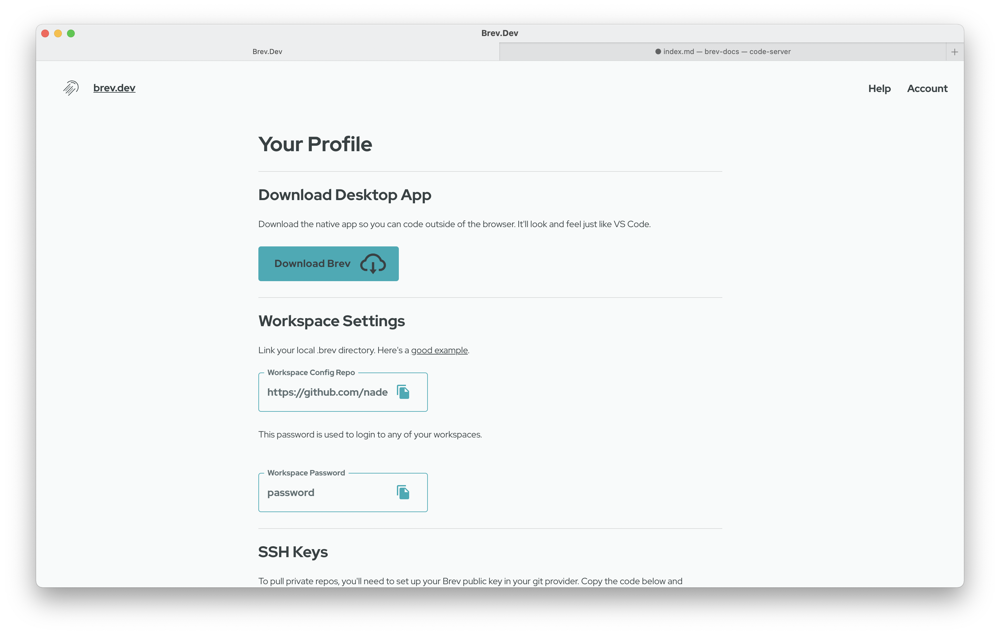

# Reference

We're in between Brev versions right now and a lot of the docs are quickly becoming outdated. If you're looking for GPU documentation, please [click here.](gpu.md)

Brev creates your powerful computer in the cloud for development. Everything has moved to the cloud except your development, which doesn't make a ton of sense since development has the most to benefit from the cloud:

- unlimited ram and CPU
- instant upgrades to the latest and greatest hardware
- no more wasting time with machine configurations
- get a public url for anything you're working on: APIs, front ends, etc.

Brev is not a streamed computer-- it's a service that configures your powerful cloud computer for you to build anything with. You are the superuser on your Brev machine.

## [The .brev directory](dot-brev-setup-script.md)

Brev solves configurations with the .brev directory.

There are two types of configurations:

1. Personal dev configs, such as Zsh vs Bash, light mode vs dark mode, keybindings, and certain extensions
2. Repo configs, such as node version, python version, any specific installation/set up/onboarding instructions.

## Personal .brev

For the first type of configs, go to your Account and update the Workspace Settings Repo. You'll need a git repo that just contains a .brev/setup.sh file. Fork this repo as a good place to start.

## Project .brev

Automatically configure your project for any new contributor by commiting a .brev/setup.sh to the code repository. Brev will automatically execute the script for every new workspace created. Brev automatically creates the .brev/setup.sh if it doesn't exist.
