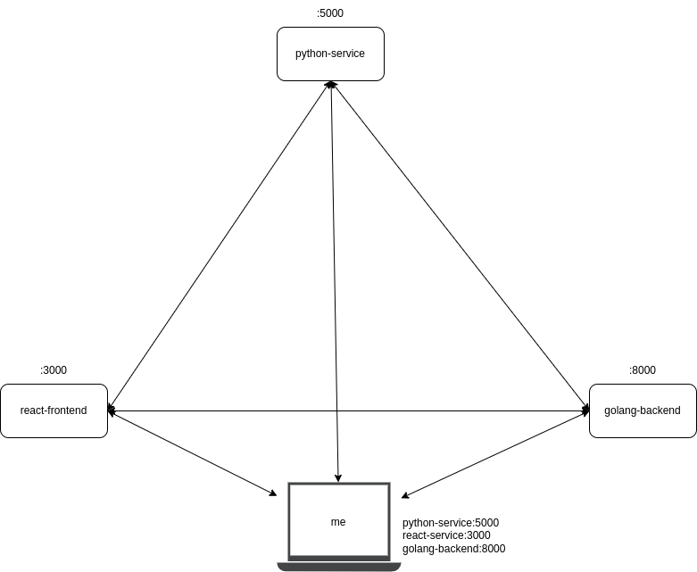
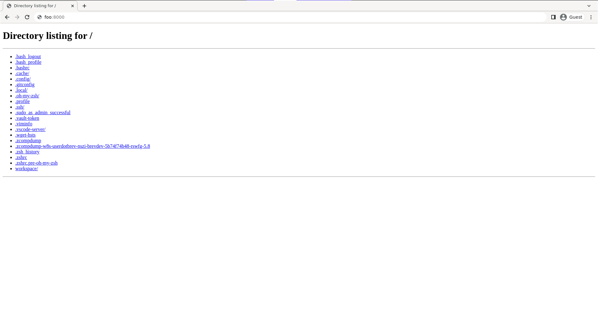

# Point to Point workspace networking




All of your brev workspaces come equipped with a point to point networking configured to allow you to connect to a workspace by its name. For example, if you created an empty workspace with

```shell
brev start --empty --name foo
```
and deployed a webserver in your workspace with

```shell
python -m http.server
```


you will be able to access the webserver from any workspace by using the hostname `foo`. For example, from my laptop if I run


```shell
curl foo:8000
```

I will recieve a response from the webserver.

```shell
$ curl foo:8000
<!DOCTYPE HTML PUBLIC "-//W3C//DTD HTML 4.01//EN" "http://www.w3.org/TR/html4/strict.dtd">
<html>
<head>
<meta http-equiv="Content-Type" content="text/html; charset=utf-8">
<title>Directory listing for /</title>
</head>
<body>
<h1>Directory listing for /</h1>
<hr>
<ul>
<li><a href=".bash_logout">.bash_logout</a></li>
<li><a href=".bash_profile">.bash_profile</a></li>
<li><a href=".bashrc">.bashrc</a></li>
<li><a href=".cache/">.cache/</a></li>
<li><a href=".config/">.config/</a></li>
<li><a href=".gitconfig">.gitconfig</a></li>
<li><a href=".local/">.local/</a></li>
<li><a href=".oh-my-zsh/">.oh-my-zsh/</a></li>
<li><a href=".profile">.profile</a></li>
<li><a href=".ssh/">.ssh/</a></li>
<li><a href=".sudo_as_admin_successful">.sudo_as_admin_successful</a></li>
<li><a href=".vault-token">.vault-token</a></li>
<li><a href=".viminfo">.viminfo</a></li>
<li><a href=".vscode-server/">.vscode-server/</a></li>
<li><a href=".wget-hsts">.wget-hsts</a></li>
<li><a href=".zcompdump">.zcompdump</a></li>
<li><a href=".zcompdump-w8s-userdotbrev-nszi-brevdev-5b74f74b48-rswfg-5.8">.zcompdump-w8s-userdotbrev-nszi-brevdev-5b74f74b48-rswfg-5.8</a></li>
<li><a href=".zsh_history">.zsh_history</a></li>
<li><a href=".zshrc">.zshrc</a></li>
<li><a href=".zshrc.pre-oh-my-zsh">.zshrc.pre-oh-my-zsh</a></li>
<li><a href="workspace/">workspace/</a></li>
</ul>
<hr>
</body>
</html>
```


or I can navigate to my browser and navigate to my service there.





The behavior of workspace networking is that each workspace in an orginization is a part of the same point to point network, and any workspace in this network can be accessed over a network by it's name. Switching orginizations will switch the networking from one group of workspaces to another.
